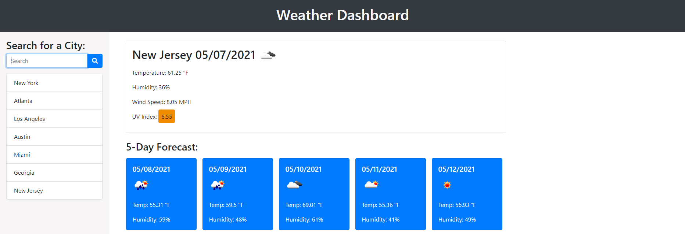

# Weather-Dashboard
The purpose of this application is to allow users to get weather information for any city.
Users are allowed to enter a city in the search field to display a 5 day weather for cast.
Upon refreshing the page, the recent searches will be there and users can click back to a city.
Depending on the number, the uv index will change colors to represent the severity for the given city.
Color indicators are 3-5 (Yellow = Moderate), 6-7 (Orange = High), 8-10 (Red = Very High) and 11+ (Violet = Extreme).

# Website Demo

# Technologies Used
- BootStrap
- CSS
- HTML
- Javascript
- Jquery 
- Moment.js
- OpenWeather API